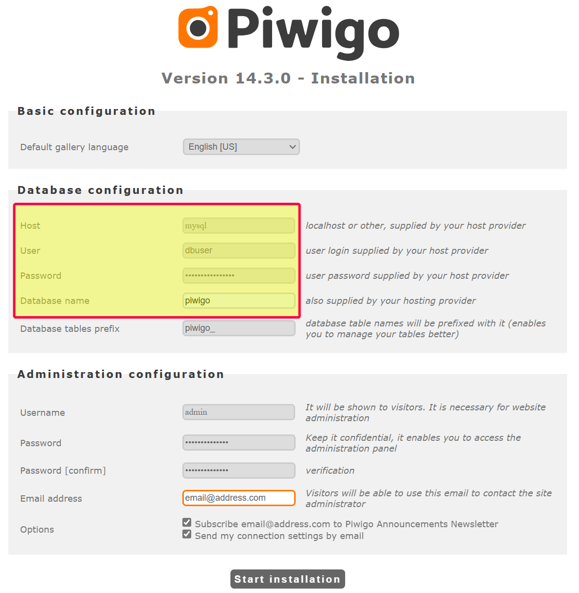

<p align="right" width="100%">
    
</p>

# Tyzen9's Piwigo and MySQL Docker Multi-Container
Docker container that provides both Piwigo and MySQL services.


## Prerequisites
Install [Docker Engine](https://docs.docker.com/get-docker/) or [Docker Desktop](https://docs.docker.com/desktop/) if you require the Docker user interface.  In production it's generally best to use [Docker Engine](https://docs.docker.com/get-docker/) on a Linux host operating system.

This documentation assumes you have a working knowledge of [Docker](https://www.docker.com/), [MySQL](https://www.mysql.com/), and [Piwigo](https://piwigo.org/).

## Configuration
This `docker-compose` implementation is configured using a `.env` file.  
The `.env` file contains comments explaining what each configuration value does.

1. Rename the `.env.sample` file to `.env`
2. Edit the `.env` file and populate the parameters according to your environment.

> :point_right:
> The `.env` file is where you can declare what versions of Piwigo and MySQL you desire.

If you desire the ability to connect to the MySQL instance from another machine (for example with MySQL Workbench), then uncomment the following lines in the `docker-compose.yml` file by removing the `#` characters:

```yaml
    # ports:
    #  - ${MYSQL_EXTERNAL_PORT}:3306
```

## Start the Container (Development/Testing)

1. Clone this repository: `git clone https://github.com/tyzen9/docker-piwigo-mysql.git`
1. Rename the resulting directory to reflect the name of your site
1. Once the `.env` file is created and populated according to the needs of your development environment, using the command prompt navigate to the project's root directory and run the following command:

```
docker compose up
```

## First time Piwigo "Installation"
When running the service for the first time on `http://host_name:<PIWIGO_EXTERNAL_PORT>`, you will be prompted to install Piwigo. You will need information from the `.env` file to complete this.

<p align="center" width="100%">
    
</p>

### Database Configuration

1. For the `Host` use `mysql`, which is the service name in the `docker-compose.yml` file
2. For `User` use the `MYSQL_USER` from the `.env` file
3. For `Password` use the `MYSQL_PASSWORD` from the `.env` file
4. For `Database name` use the `MYSQL_DATABASE` from the `.env` file

### Administration Configuration

These are the settings that are used to configure the Piwigo administration console.  You should use a strong username and password combination here.

Finally, click `Start Installation` and you Piwigo is set and ready to be used.  The first thing you will likely want to do is login to the Administration Panel and [import your galleries](https://piwigo.org/doc/doku.php?id=user_documentation:learn:add_picture). 

## MySQL Backups
A shell script can be created to execute a MySQL database backup:

```
docker exec <PIWIGO_CONTAINER_ID> /usr/bin/mysqldump -u root -p<MYSQL_ROOT_PASSWORD> <MYSQL_DATABASE> > piwigo_dump.sql 2>/dev/null
```

- Create a shell script containing the properly formatted command for your environment, and use a `root` cronjob to schedule these backups.
- The resulting `piwigo_dump.sql` file should be stored on a routinely backed up remote filesystem.

## Production Deployment using Portainer
I use [Portainer](https://www.portainer.io/) to manage and orchestrate my Docker resources in my Production environments. To deploy this into your Portainer environment:

1. Prepare a `.env` file for the Portainer environment
2. In Portainer, choose the Environment to deploy to
3. In the left menu choose Stacks, then click `+ Add stack`
4. Choose `Repository` and fill in the required fields (don't forget name at the top)
5. At the bottom, there is an option to `Load variables from .env file`. Click this button and provide the prepared `.env` file for this environment.
6. Click `Deploy the stack`

Once successfully deployed, you will be able to access the site at: `http://host_name:<PIWIGO_EXTERNAL_PORT>`.